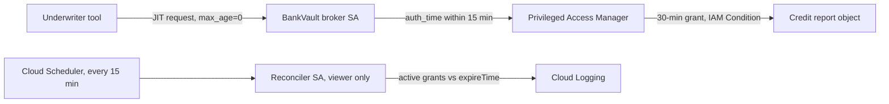

# BankVault ADR-003: PAM grant and revocation lifecycle

- **Decision Owner:** Lanre Oluokun
- **Date:** 2026-07-08
- **Status:** Accepted
- **Implementation:** In progress. `main.py` identity validation is stubbed; the reconciliation job and the key-creation org policy are not built yet.

## Context

The freshness check in BankVault ADR-002 gates one moment: when the grant is issued. It says nothing about the 30 minutes that follow.

This lifecycle governs how long an underwriter's access to GLBA-regulated NPI in Cloud Storage lasts once the ADR-002 check has passed. ADR-001 fixed the actor and scope. ADR-002 gates the grant request on a fresh MFA event. This record does not re-check freshness during the access window, and that boundary is stated on purpose rather than assumed.

## Decision

GCP Privileged Access Manager (GA) issues the grant through a project-level entitlement with `maxRequestDuration = 1800s` (30 minutes). The role binding carries a static IAM Condition scoping access to the one credit-report object from ADR-001, evaluated on every access attempt for the life of the grant. The broker's dedicated service account is the sole eligible requester on this entitlement, with no exportable keys once the org policy is applied. It calls PAM's grant API after the ADR-002 check passes.

```
resource.type == "storage.googleapis.com/Object" &&
resource.name == "projects/_/buckets/{BANKVAULT_NPI_BUCKET}/objects/{CREDIT_REPORT_OBJECT}"
```

## Lifecycle diagram



## Consequences

**Positive:**

- GA handles the grant lifecycle.
- The resource-path check runs on every access, not just at grant time.
- The broker identity and the monitoring identity are separate, which bounds blast radius on either side.

**Negative:**

- MFA freshness gates grant issuance, not the full 30-minute window. A session compromised after a valid grant is active inherits that access with no further freshness check for the rest of the window.
- The static CEL does not generalize past one actor and one object without rearchitecting.
- PAM's behavior on a missed auto-expiry is undocumented.

## Monitoring

A separate service account holds only `roles/privilegedaccessmanager.viewer` on this entitlement. A Cloud Scheduler job runs every 15 minutes and invokes a Cloud Function that lists active grants and compares each against the `expireTime` PAM returns for that grant. Overruns are written to Cloud Logging. This is detective only. The job flags; it does not revoke.

## Residual risk

This is a detection bound, not an exposure bound. If PAM's expiry silently fails, the overrun is flagged within about 15 minutes, but access stays active until a person acts on the log entry. There is no automatic revoke. The honest claim is "detected within about 45 minutes" (a 30-minute grant plus up to 15 minutes of detection lag), not "contained within about 45 minutes." That is acceptable for portfolio scope, since PAM's expiry is expected to work and this is a backstop for an undocumented failure mode rather than a primary control. It would need tightening before any real deployment.

## Rationale

PAM automates the specific, repeated judgment the Safeguards Rule asks for, reconsidering legitimate business need for access, by re-deciding it per request instead of on a periodic manual cycle. This supports one control inside a Safeguards Rule program. It is not compliance on its own.

## Alternatives considered

| Alternative | Pros | Cons | Verdict |
|---|---|---|---|
| Custom IAM Conditions plus a Cloud Function grant/revoke layer | Full control over revocation triggers | Reimplements a GA lifecycle GCP already manages | Rejected. |
| Session-bound revocation | Tighter security window | Needs OIDC back-channel logout from the IdP, which is unverified | Deferred. Revisit once back-channel logout is confirmed. |
| Standing access, manual revocation | Simplest to build | Defeats the JIT premise | Rejected. |

## Known gaps

These are implementation gaps, not architecture gaps.

- The `main.py` identity-validation stub is not implemented.
- The reconciliation job, its dedicated service account, and any automatic-revoke action are not built.
- The `iam.disableServiceAccountKeyCreation` org policy is not applied or confirmed.

## Prerequisites and assumptions requiring verification

- The target GCS bucket has uniform bucket-level access enabled, which the IAM Condition needs.
- Exact-match CEL on a full object path, inside a PAM entitlement condition specifically, is a standard CEL pattern but is not confirmed against a worked GCP example. Treat it as likely, not verified.
- The Cloud Logging write happens synchronously with grant activation and expiry.
- OIDC back-channel logout on the identity provider (Google Identity or workforce identity federation) is unverified.

## References

- [GLBA Safeguards Rule (16 CFR 314)](https://www.ecfr.gov/current/title-16/chapter-I/subchapter-C/part-314)
- [Privileged Access Manager overview](https://cloud.google.com/iam/docs/pam-overview)
- [IAM Conditions overview](https://cloud.google.com/iam/docs/conditions-overview)
