# Architecture Decision Records: Multi-Jurisdictional Data Residency & Retail Loyalty Security

> **Author:** Lanre — Cloud Security / Enterprise Architect  
> **Certifications:** CISSP, CCSP, CISM, ISSAP, GCP-PCA  
> **Date:** 2026-08-20

---

## Table of Contents

- [Overview](#overview)
- [ADR-005: Regional Data Residency & Hierarchical Encryption](#adr-005-regional-data-residency--hierarchical-encryption)
  - [Context](#context)
  - [Decision](#decision)
  - [Consequences](#consequences)
  - [Compliance & Control Mapping](#compliance--control-mapping)
  - [Verification & Evidence](#verification--evidence)
  - [Architecture Overview](#architecture-overview)
  - [Traceability to Requirement Baseline](#traceability-to-requirement-baseline)
  - [Implementation Roadmap](#implementation-roadmap)
  - [Risk Register](#risk-register)
  - [References](#references)
- [ADR-006: Security Architecture — Retail Loyalty Platform](#adr-006-security-architecture--retail-loyalty-platform)
  - [Context](#context-1)
  - [Decision](#decision-1)
  - [Threat-to-Control Mapping](#threat-to-control-mapping)
  - [PCI-DSS Scope Decision](#pci-dss-scope-decision)
  - [Trust Boundary Controls](#trust-boundary-controls)
  - [Compliance Mapping](#compliance-mapping)
  - [Consequences](#consequences-1)
  - [Related Decisions](#related-decisions)
  - [References](#references-1)
- [Fix Log: Validation & Critique Response](#fix-log-validation--critique-response)

---

## Overview

This post contains two Architecture Decision Records (ADRs), written as exercises in applying enterprise security architecture principles to realistic scenarios. An adversarial review challenged every claim in both documents. The fixes are inline.

**ADR-005** addresses a multinational insurer launching a claims portal across GDPR, UK GDPR, HIPAA, and APAC privacy regimes. It decides on regional data residency, with customer-managed encryption keys bound to jurisdictional boundaries.

**ADR-006** addresses a retailer building a cloud-native loyalty platform. It decides on Zero Trust architecture, SAQ-A PCI scope minimization via a hosted payment page, and loyalty-specific fraud controls.

Neither ADR contains fictional cross-references or unflagged gaps.

---

## ADR-005: Regional Data Residency and Hierarchical Encryption Strategy for Multi-Jurisdictional Claims Portal

| Field | Value |
|-------|-------|
| **Status** | Proposed |
| **Date** | 2026-08-20 |
| **Author** | Lanre — Cloud Security / Enterprise Architect |
| **Deciders** | Enterprise Architect, DPO, Legal Counsel, Cloud Engineering |


### 1. Context

#### 1.1 Scenario Overview

A multinational insurer is launching a **customer-facing claims portal** on a **public-cloud IaaS platform**. The portal processes **personal and health-related data** for policyholders across multiple jurisdictions:

- **European Union** — GDPR jurisdiction
- **United Kingdom** — UK GDPR / Data Protection Act 2018
- **United States** — HIPAA (health data, **see scoping assumption below**), state-level privacy laws (CCPA/CPRA, etc.)
- **Asia-Pacific markets** — including jurisdictions covered by PDPA (Singapore), APPI (Japan), and DPDP (India)

**HIPAA Scoping Assumption:** This ADR assumes the insurer operates health plans, giving it HIPAA-covered entity status in the US market. Property, casualty, life, and auto lines that do not process PHI fall outside the HIPAA controls referenced here. The DPO must confirm covered-entity status before finalizing HIPAA obligations.

**Key Business Parameters:**

| Parameter | Value | Source |
|-----------|-------|--------|
| Platform Model | IaaS (Infrastructure as a Service) | Business requirement |
| Data Types | Personal data + health-related data | Policyholder claims |
| Sensitivity Tier | **High** — health data triggers enhanced controls | Data classification |
| Outage Tolerance (MTD) | 4 hours | Business statement |
| User Base | Multi-jurisdictional (EU, UK, US, Asia) | Global operations |
| Hosting Arrangement | Public cloud | Cost / scalability driver |

The architect must **establish the requirement baseline before design begins**. This ADR covers the data architecture decisions that constrain later security, availability, and compliance choices.

#### 1.2 Constraints & Forces

##### 1.2.1 Privacy Regime Collision

The multi-jurisdictional spread triggers the **"deconfliction discipline."** The applicable privacy regimes differ in:

| Regime | Key Constraint | Stringency |
|--------|---------------|------------|
| **GDPR (EU)** | Cross-border transfers require adequacy decision, SCCs + TIA, or BCRs. 72-hour breach notification. | Very High |
| **UK GDPR** | Post-Brexit adequacy decisions diverge from EU. Independent ICO enforcement. | Very High |
| **PDPA (Singapore)** | Consent-based transfer; DPO notification for cross-border arrangements. | High |
| **APPI (Japan)** | Cross-border transfer requires opt-out or equivalent consent; PPC notification for third-country transfers. | High |
| **US (HIPAA)** | Business Associate Agreements required. Minimum necessary standard. Breach notification 60 days. | High |
| **Asian Local Regimes** | Varying data-export restrictions, localization requirements, breach-notification windows | Variable |

**Deconfliction Rule:** Design to the **strictest applicable regime** on each dimension: notification window, transfer rule, and localization requirement. Surface any genuine conflict to legal counsel and the risk owner rather than resolving it silently.

**China Exclusion Note:** Phase 1 excludes mainland China. GCP has no mainland China region, and PIPL requires in-country infrastructure and a security assessment for cross-border transfer of important data. China needs its own deployment through a local partner or a compliant in-country cloud provider. ADR-007 (China Market Entry) covers it. The "APAC region" in this ADR means Singapore, Japan, India, and other non-China markets.

##### 1.2.2 IaaS Shared Responsibility Split

Under an IaaS model, the responsibility boundary is well-defined:

| Layer | Provider Responsibility | Customer Responsibility |
|-------|------------------------|------------------------|
| Physical infrastructure | Secures data centers, power, cooling, physical access | Verify via SOC 2 Type II, site visits (where possible) |
| Network infrastructure | Secures backbone, edge, DDoS protection | Configure VPCs, firewalls, encryption in transit |
| Hypervisor / virtualization | Patches, isolates tenant workloads | Verify via CSA STAR, compliance reports |
| Operating system | **Customer** | Harden, patch, monitor, configure |
| Middleware / runtime | **Customer** | Secure configuration, vulnerability management |
| Application | **Customer** | Secure SDLC, input validation, authentication |
| Data | **Customer** | Classification, encryption, access control, retention |
| Identity & Access Management | **Customer** | IAM policies, MFA, least privilege, audit logging |

**Critical implication:** Because the data is regulated and held by the insurer (not the provider), **verification cannot rest on trust**. The architect requires:
- Provider's **SOC 2 Type II report** (operating effectiveness over time, **not merely Type I design**)
- Provider's position on the **CSA STAR registry**
- Contractually verifiable obligations written into the agreement:
  - Encryption standards and key management
  - Breach notification within the strictest applicable window
  - Sub-processor disclosure and consent
  - Data deletion on exit with evidence

##### 1.2.3 High-Sensitivity Data Classification

**Health-related data** raises the classification to the **highest sensitivity tier**. This triggers:

- Enhanced encryption requirements (at-rest, in-transit, in-use where feasible)
- Stricter access controls (need-to-know, just-in-time)
- Enhanced logging and monitoring
- Shorter retention periods (where regulation permits)
- Mandatory privacy impact assessments (DPIA / PIA)

##### 1.2.4 Availability Context — The Four-Hour MTD

The business has stated that a claims outage longer than four hours would cause **unacceptable reputational and regulatory harm**. This is an **MTD (Maximum Tolerable Downtime) signal**.

**The correct first move is NOT to jump to a hot site.** The architect must:

1. **Commission a formal BIA (Business Impact Analysis)** that confirms the four-hour figure
2. **Separate MTD into RTO (Recovery Time Objective)** and any work-recovery time
3. **Establish RPO (Recovery Point Objective)** — how much claims data the business can tolerate losing
4. **Only then** design availability architecture proportional to validated requirements

> The four-hour MTD is a business signal, not an architecture directive. The architect's first move is to commission a BIA. That BIA validates the figure and decomposes it into RTO and work-recovery time. It also establishes the RPO from how much claims data loss the business can tolerate. Only then does availability architecture follow.

With those numbers, the likely shape is a **multi-availability-zone active design** on the cloud platform. It pairs **continuous replication for a tight RPO** with an **isolated, immutable backup**. The backup guards against ransomware that replication would otherwise propagate. Derive this shape from the objectives rather than assuming it.

##### 1.2.5 Privacy Management System Standards

The health data and privacy exposure point toward:

- **ISO/IEC 27701** for the privacy information management system (PIMS)
- **ISO/IEC 27018** for cloud PII handling
- Layered over a **27001 ISMS** (Information Security Management System)
- **CSA CCM (Cloud Controls Matrix)** as the cloud control reference

#### 1.3 Problem Statement

How do we store, encrypt, and manage claims data across multiple jurisdictions such that:

1. **Data residency and sovereignty requirements** are satisfied per jurisdiction?
2. **Encryption keys are bound** to the same jurisdictional boundary as the data they protect?
3. **Cross-border data flows** occur only where legally permitted and contractually governed?
4. **The architecture does not create a single centralized breach surface** that violates the "strictest regime" principle?
5. **Provider verification** is contractually enforceable, not assumed?
6. **Availability design** is proportional to BIA-validated RTO/RPO, not driven by an unvalidated MTD assertion?


### 2. Decision

#### 2.1 Selected Approach

We will adopt a **Regional Data Residency model with Hierarchical Customer-Managed Encryption Keys (CMEK)**.

##### 2.1.1 Regional Deployment Model

| Layer | Decision | Rationale |
|-------|----------|-----------|
| **Compute** | Regional IaaS clusters deployed in EU, UK, US, and Asia-Pacific regions. | Pins compute to jurisdictional boundaries. |
| **Storage** | Regional managed databases and regional object-storage buckets. | Data is pinned to the region of the policyholder's jurisdiction at ingestion time. |
| **Encryption at Rest** | CMEK using cloud HSM-backed keys. Each region has an isolated **Key Ring** in a regional HSM. | Key material never leaves the geographic boundary. Cryptographic erasure is possible. |
| **Encryption in Transit** | TLS 1.3 everywhere. Mutual TLS (mTLS) for service-to-service communication within each regional mesh. | Prevents interception and man-in-the-middle attacks. |
| **Cross-Border Flows** | Permitted only via explicit legal mechanisms (SCCs with Transfer Impact Assessments, adequacy decisions, or PIPL security assessments where threshold-met). | Satisfies deconfliction discipline. |
| **Global Control Plane** | Restricted to IAM, API Gateway routing logic, and operational metadata. The Jurisdiction Router processes transient personal data (user ID, jurisdiction mapping) for routing decisions but does not persist health data, claims data, or PII in durable storage. | Enables unified operations without violating data residency. |
| **Backup & DR** | Regional continuous replication to a secondary zone within the same region for RPO targets. **Isolated, immutable backups** (WORM / object-lock) in a separate project/VPC within the same region. | Satisfies ransomware resilience without violating residency. |

##### 2.1.2 Data Classification and Routing Logic

At ingestion, the portal applies **jurisdictional tagging** based on:

1. **Policyholder registration address** (primary)
2. **IP geolocation** (secondary validation)
3. **Explicit consent / jurisdiction selection** (tertiary, for edge cases)

```
┌─────────────────────────────────────────────────────────────────────┐
│                    INGESTION GATEWAY                                 │
│  ┌─────────────┐  ┌─────────────┐  ┌─────────────────────┐         │
│  │ Policyholder│  │  IP Geo     │  │ Explicit Jurisdiction│        │
│  │   Address   │  │ Validation  │  │     Selection        │        │
│  └──────┬──────┘  └──────┬──────┘  └──────────┬──────────┘         │
│         └─────────────────┴────────────────────┘                    │
│                           │                                         │
│                    ┌──────┴──────┐                                 │
│                    │  Jurisdiction │                                 │
│                    │   Resolver    │                                 │
│                    └──────┬──────┘                                 │
│                           │                                         │
│         ┌─────────────────┼─────────────────┐                      │
│         ▼                 ▼                 ▼                      │
│    ┌─────────┐      ┌─────────┐      ┌─────────┐      ┌─────────┐│
│    │   EU    │      │   UK    │      │   US    │      │  APAC   ││
│    │ REGION  │      │ REGION  │      │ REGION  │      │ REGION  ││
│    └─────────┘      └─────────┘      └─────────┘      └─────────┘│
└─────────────────────────────────────────────────────────────────────┘
```

##### 2.1.3 Encryption Key Hierarchy

```
┌─────────────────────────────────────────────────────────────────────────────────────┐
│                    ENCRYPTION KEY HIERARCHY                                          │
│                                                                                      │
│  TIER 0: REGIONAL ROOT KEYS (Independent per jurisdiction)                           │
│  ┌─────────────────────────┬─────────────────────────┬─────────────────────────┐    │
│  │    EU-ROOT-KEY          │    UK-ROOT-KEY          │    US-ROOT-KEY          │    │
│  │    (Stored in EU HSM)   │    (Stored in UK HSM)   │    (Stored in US HSM)   │    │
│  │                         │                         │                         │    │
│  │  • Used ONLY for:       │  • Used ONLY for:       │  • Used ONLY for:       │    │
│  │    - Wrapping EU KEKs   │    - Wrapping UK KEKs   │    - Wrapping US KEKs   │    │
│  │    - EU escrow recovery │    - UK escrow recovery │    - US escrow recovery │    │
│  │  • Access: CISO + DPO   │  • Access: CISO + DPO   │  • Access: CISO + DPO   │    │
│  │    dual control         │    dual control         │    dual control         │    │
│  │  • NEVER wraps non-EU   │  • NEVER wraps non-UK   │  • NEVER wraps non-US   │    │
│  │    keys                 │    keys                 │    keys                 │    │
│  └───────────┬─────────────┴───────────┬─────────────┴───────────┬─────────────┘    │
│              │                         │                         │                  │
│  ┌───────────┴───────────┐  ┌──────────┴─────────────────────────┴────────────┐   │
│  │    APAC-ROOT-KEY      │  │                                                 │   │
│  │    (Stored in APAC    │  │                                                 │   │
│  │     HSM)              │  │                                                 │   │
│  │  • Used ONLY for:     │  │                                                 │   │
│  │    - Wrapping APAC    │  │                                                 │   │
│  │      KEKs             │  │                                                 │   │
│  └───────────┬───────────┘  │                                                 │   │
│              │               │                                                 │   │
│  TIER 1: REGIONAL KEY ENCRYPTION KEYS (KEKs)                                        │
│  ┌─────────────────────────┬─────────────────────────┬─────────────────────────┐    │
│  │    EU-KEK-01            │    UK-KEK-01            │    US-KEK-01            │    │
│  │    (AES-256-GCM)        │    (AES-256-GCM)        │    (AES-256-GCM)        │    │
│  │                         │                         │                         │    │
│  │  • Regional HSM only    │  • Regional HSM only    │  • Regional HSM only    │    │
│  │  • Rotated annually     │  • Rotated annually     │  • Rotated annually     │    │
│  │  • Wraps EU DEKs        │  • Wraps UK DEKs        │  • Wraps US DEKs        │    │
│  │  • No cross-region use  │  • No cross-region use  │  • No cross-region use  │    │
│  └─────────────────────────┴─────────────────────────┴─────────────────────────┘    │
│              │                       │                       │                       │
│  ┌─────────────────────────┬─────────────────────────┬─────────────────────────┐    │
│  │    APAC-KEK-01          │                         │                         │    │
│  │    (AES-256-GCM)        │                         │                         │    │
│  │  • Regional HSM only    │                         │                         │    │
│  │  • Rotated annually     │                         │                         │    │
│  │  • Wraps APAC DEKs      │                         │                         │    │
│  │  • No cross-region use  │                         │                         │    │
│  └─────────────────────────┴─────────────────────────┴─────────────────────────┘    │
│              │                       │                       │                       │
│  TIER 2: DATA ENCRYPTION KEYS (DEKs)                                                 │
│  ┌─────────────────────────┬─────────────────────────┬─────────────────────────┐    │
│  │  EU-DEK-DB-001          │  UK-DEK-DB-001          │  US-DEK-DB-001          │    │
│  │  EU-DEK-DB-002          │  UK-DEK-DB-002          │  US-DEK-DB-002          │    │
│  │  EU-DEK-OBJ-001         │  UK-DEK-OBJ-001         │  US-DEK-OBJ-001         │    │
│  │  ...                    │  ...                    │  ...                    │    │
│  │  • Per-resource DEKs    │  • Per-resource DEKs    │  • Per-resource DEKs    │    │
│  │  • Rotated every 90d    │  • Rotated every 90d    │  • Rotated every 90d    │    │
│  │  • Auto-generated by    │  • Auto-generated by    │  • Auto-generated by    │    │
│  │    KMS, wrapped by KEK  │    KMS, wrapped by KEK  │    KMS, wrapped by KEK  │    │
│  │  • Re-wrap existing     │  • Re-wrap existing     │  • Re-wrap existing     │    │
│  │    objects within 30d   │    objects within 30d   │    objects within 30d   │    │
│  │    of rotation          │    of rotation          │    of rotation          │    │
│  └─────────────────────────┴─────────────────────────┴─────────────────────────┘    │
│                                                                                      │
│  ┌─────────────────────────┐                                                         │
│  │  APAC-DEK-DB-001        │                                                         │
│  │  APAC-DEK-DB-002        │                                                         │
│  │  APAC-DEK-OBJ-001       │                                                         │
│  │  ...                    │                                                         │
│  │  • Per-resource DEKs    │                                                         │
│  │  • Rotated every 90d    │                                                         │
│  │  • Auto-generated by    │                                                         │
│  │    KMS, wrapped by KEK  │                                                         │
│  │  • Re-wrap within 30d   │                                                         │
│  └─────────────────────────┘                                                         │
│                                                                                      │
│  KEY BINDING INVARIANT:                                                              │
│  ∀ DEK : region(DEK) == region(data_protected_by_DEK) ==                            │
│          region(KEK_wrapping_DEK) == region(ROOT_wrapping_KEK)                       │
│                                                                                      │
│  VIOLATION = ARCHITECTURE FAILURE                                                   │
│                                                                                      │
│  ESCROW NOTE: Each region maintains independent key escrow with a                    │
│  third-party escrow agent under jurisdiction-specific contract. No                   │
│  single escrow holder holds keys for multiple regions.                               │
└─────────────────────────────────────────────────────────────────────────────────────┘
```

**Key Management Principles:**

| Principle | Implementation |
|-----------|---------------|
| **Regional Binding** | Each DEK is wrapped by a regional KEK in a regional HSM; each KEK is wrapped by a regional Root Key in the same regional HSM |
| **No Cross-Region Wrapping** | No key from one region ever wraps a key from another region. Regional key hierarchies are cryptographically isolated. |
| **Customer Managed** | The insurer, not the cloud provider, controls key lifecycle (creation, rotation, destruction) |
| **HSM-Backed** | All key material resides in FIPS 140-3 Level 3 (or FIPS 140-2 Level 3 pending provider re-validation) HSMs |
| **No Key Export** | Key material never leaves the HSM boundary — only wrapped keys and ciphertext flow |
| **Cryptographic Erasure (Bulk)** | Regional key destruction = bulk data deletion for contract exit or region decommissioning |
| **Record-Level Deletion (Art. 17)** | Individual data-subject erasure requests use record-level deletion; cryptographic erasure is reserved for bulk/contract scenarios |
| **Rotation** | Automatic rotation every 90 days for DEKs; annual rotation for KEKs; re-wrap of existing objects within 30 days of DEK rotation |
| **Dual Control** | Key ceremonies require two authorized personnel with split knowledge |

#### 2.2 Rejected Alternatives

##### Alternative A: Single Global Data Store with Unified Encryption

| Aspect | Assessment |
|--------|------------|
| **Description** | One global database (e.g., Cloud Spanner, Cosmos DB, DynamoDB Global Tables) with a single encryption key |
| **Why Rejected** | Fails PIPL data-localization implications. Violates GDPR transfer-restriction rigor for health data. Creates a single breach surface where one compromise exposes all jurisdictions. Violates deconfliction discipline. |
| **Residual Use** | May be acceptable for non-PII operational metadata only (e.g., IAM policies, routing tables) |

##### Alternative B: Fully Siloed Per-Country Deployments with Zero Shared Control Plane

| Aspect | Assessment |
|--------|------------|
| **Description** | Completely independent deployments per country with no shared infrastructure |
| **Why Rejected** | Maximizes compliance but fragments operations, duplicates cost (5-10x infrastructure), prevents unified claims analytics, and creates an inconsistent customer experience. The business requires a single customer-facing portal. |
| **Residual Use** | Required for mainland China if PIPL security assessment thresholds are met and no adequate transfer mechanism exists; scoped to ADR-007 |

##### Alternative C: Global Active-Active Database with Geo-Partitioning

| Aspect | Assessment |
|--------|------------|
| **Description** | Global active-active database with geo-partitioning (e.g., CockroachDB, YugabyteDB, Spanner with regional placement) |
| **Why Rejected** | Adds significant complexity (conflict resolution, split-brain risk, transaction ordering) before the BIA validates whether sub-hour RTO justifies the cost. Also, geo-partitioning alone does not solve the encryption key residency problem. Revisit if BIA output demands multi-region active-active with validated business justification. |
| **Residual Use** | Re-evaluate after BIA confirms RTO < 1 hour and cost-benefit analysis is completed |


### 3. Consequences

#### 3.1 Positive

| # | Benefit | Explanation |
|---|---------|-------------|
| 1 | **Regulatory de-risking** | Data and keys remain within jurisdictional boundaries by default. Cross-border transfers become explicit, documented, and legally gated. |
| 2 | **Breach containment** | A compromise in one region does not automatically expose policyholders in another region. The blast radius is geographically bounded. |
| 3 | **Cryptographic erasure (bulk)** | When exiting a region or terminating a provider contract, destroying the regional key material provides verifiable assurance of bulk data deletion — a contractually required obligation. |
| 4 | **Provider verification alignment** | Regional HSMs and regional services map cleanly to SOC 2 Type II and CSA CCM controls that the provider can evidence independently per region. |
| 5 | **Audit simplicity** | Regulators can be shown a clear boundary: "EU data in EU, encrypted by EU keys, managed under EU ISMS scope." |
| 6 | **Ransomware resilience** | Immutable, isolated backups within each region protect against ransomware propagation without creating cross-border data flows. |

#### 3.2 Negative / Risks

| # | Risk | Severity | Mitigation |
|---|------|----------|------------|
| 1 | **Operational complexity** | High | Engineering must manage four+ regional deployments, key ceremonies, and patch cycles. Mitigate via infrastructure-as-code (Terraform), centralized CI/CD with regional parameterization, and runbook automation. |
| 2 | **Cost increase** | Medium-High | Regional HSM instances, duplicated environments, and intra-region replication increase baseline spend 2-3x versus centralized design. **Rough order-of-magnitude: ~$180K–$240K/year.** Assumes 2,000 active key versions across four regions (accounting for 90-day rotation with 30-day re-wrap overlap), 4× regional GKE clusters, and HA Cloud SQL per region. Actual cost varies by provider pricing tier and reserved capacity. Mitigate via reserved capacity, spot instances for non-prod, and chargeback to business units per jurisdiction. |
| 3 | **Analytics fragmentation** | Medium | Cross-jurisdictional claims analytics requires aggregation pipelines that must re-apply de-identification or operate on anonymized datasets only. Mitigate via a dedicated "analytics zone" with differential privacy, k-anonymity, or synthetic data generation. |
| 4 | **Key custody risk** | Critical | Loss of regional HSM access (e.g., due to provider account lockout, key ceremony failure, or organizational dispute) results in permanent data unavailability for that region. Mitigate via documented key-escrow with a third-party escrow agent, break-glass procedures, and quarterly key-recovery drills. |
| 5 | **Consistency challenges** | Medium | Eventually consistent cross-region operations (e.g., global policy updates) may lag. Mitigate via CRDTs for conflict-free replicated data types where applicable, and explicit consistency models documented per use case. |
| 6 | **Legal mechanism overhead** | Medium | Maintaining SCCs, TIAs, BCRs, and PIPL security assessments across multiple jurisdictions creates legal overhead. Mitigate via a centralized legal-ops function with jurisdiction-specific counsel and annual mechanism review. |


### 4. Compliance & Control Mapping

#### 4.1 Regulatory Framework Mapping

| Requirement | Standard / Regulation | Architectural Element | Evidence Artifact |
|-------------|----------------------|----------------------|-------------------|
| Privacy Management System | ISO/IEC 27701:2019 | Regional data pinning + DPO-accessible audit logs per region | ISO 27701 audit report per region |
| Cloud PII Handling | ISO/IEC 27018:2019 | CMEK, access logging, data-deletion workflows | Cloud provider ISO 27018 certification |
| ISMS Foundation | ISO/IEC 27001:2022 | Regional ISMS scope boundaries, risk treatment per jurisdiction | ISO 27001 certificate with regional scope statements |
| Cloud Controls | CSA CCM v4.0 | Provider SOC 2 Type II + CSA STAR registry verification | CSA STAR certificate, SOC 2 Type II report |
| Data Residency / Transfer | GDPR Arts. 44-49 | SCCs + TIA for any EU data leaving adequacy boundaries | Executed SCCs with TIA documentation |
| Data Localization (China) | PIPL (China), Art. 38-43 | **Scoped to ADR-007** — mainland China requires separate in-country deployment | PIPL security assessment filing (ADR-007) |
| Data Localization (Other APAC) | APPI, PDPA, DPDP | APAC-region deployment with APAC-bound key material | Local counsel verification per jurisdiction |
| Breach Notification | GDPR Art. 33 (72h), UK GDPR, PIPL | Regional logging + automated alerting to meet shortest SLA | Incident response playbooks with jurisdiction-specific SLAs |
| Sub-processor Disclosure | GDPR Art. 28, PIPL Art. 23 | Sub-processor list maintained per region in contract annex | Executed contract annexes |
| Data Deletion on Exit (Contract) | Contractual / GDPR Art. 17 (individual) | Cryptographic erasure via key destruction + metadata purge | Key destruction certificates |
| Individual Erasure (Art. 17) | GDPR Art. 17 | Record-level deletion API + metadata purge | Deletion verification audit per request |
| Encryption Standards | NIST SP 800-57, FIPS 140-3 | AES-256-GCM for data at rest, TLS 1.3 for data in transit | Cryptographic module validation certificates |

#### 4.2 Control Implementation Matrix

| Control ID | Control Name | Implementation | Test Method | Frequency |
|------------|-------------|----------------|-------------|-----------|
| SEC-001 | Data Residency Enforcement | Regional deployment with jurisdictional routing | Automated compliance scan + manual sampling | Quarterly |
| SEC-002 | Encryption at Rest | CMEK with regional HSM | Key metadata audit + ciphertext verification | Monthly |
| SEC-003 | Encryption in Transit | TLS 1.3, mTLS for internal | SSL Labs scan + certificate inventory | Weekly |
| SEC-004 | Immutable Backup | WORM object-lock on regional buckets | Backup restoration test + lock verification | Monthly |
| SEC-005 | Access Logging | Cloud Audit Logs, SIEM ingestion | Log completeness check + tamper verification | Continuous |
| SEC-006 | Key Rotation | Automatic DEK rotation (90d), KEK rotation (annual); re-wrap within 30d | Key metadata audit + sample re-wrap verification | Quarterly |
| SEC-007 | Data Deletion — Individual | Record-level deletion + metadata purge | Deletion verification audit | Per-request + annual sample |
| SEC-008 | Data Deletion — Bulk/Contract | Cryptographic erasure + metadata purge | Key destruction certificate + recovery test | Per-contract event |
| SEC-009 | Provider Verification | SOC 2 Type II, CSA STAR registry review | Document review + provider inquiry | Annual |
| SEC-010 | BIA Validation | Formal BIA confirming MTD/RTO/RPO | BIA report review | Annual / post-change |
| SEC-011 | Incident Response | Jurisdiction-specific playbooks with breach-notification SLAs | Tabletop exercise | Semi-annual |
| SEC-012 | Key Ceremony Dual Control | NIST SP 800-57 | Ceremony observation + log review | Per-ceremony |


### 5. Verification & Evidence

The following must exist in the **requirement baseline** before design proceeds to implementation:

#### 5.1 Provider Assurance

- [ ] **SOC 2 Type II report** covering the specific regional services in scope (not a generic corporate report)
  - Must include operating effectiveness over a minimum 6-month period
  - Must cover the specific IaaS services: compute, storage, database, HSM, and networking
  - Must be dated within the last 12 months

- [ ] **CSA STAR registry entry** with current position for the IaaS provider
  - Prefer Level 2 (STAR Certification) or Level 3 (STAR Continuous)
  - Must include CCM v4 control mappings

#### 5.2 Contractual Obligations (Per Region)

- [ ] **Data Processing Agreement (DPA)** executed with the cloud provider
- [ ] **Contractual annex** specifying:
  - Encryption standards (AES-256-GCM minimum) and key-management obligations
  - Breach-notification SLA (aligned to strictest applicable window — 72 hours for EU, 60 days for HIPAA, as applicable)
  - Sub-processor disclosure and consent mechanism
  - Data-deletion procedure and evidence format on contract exit
  - Audit rights (right to audit provider controls, or reliance on third-party reports)
  - Data localization commitment (provider will not move data outside specified regions without consent)

#### 5.3 Key Management

- [ ] **HSM key-ceremony documentation** with:
  - Dual-control procedures
  - Split-knowledge requirements
  - Witnessed ceremony logs
  - Key escrow arrangement with third-party escrow agent (per-region)
- [ ] **Key recovery and break-glass procedures** documented and tested
- [ ] **Key rotation schedule** approved by CISO and DPO, including re-wrap procedure for existing objects

#### 5.4 Business Impact Analysis

- [ ] **BIA commissioning record** confirming:
  - The four-hour MTD figure (validated, not assumed)
  - Derived RTO (Recovery Time Objective)
  - Work-recovery time component
  - RPO (Recovery Point Objective) — how much claims data can be lost
  - Critical system dependencies and single points of failure

> **Note:** BIA output does **not** block the data-residency decision in this ADR. The availability architecture (DR, backup frequency, replication topology) **is** dependent on validated BIA results. ADR-006 (Availability and Disaster Recovery Architecture) follows BIA completion.

#### 5.5 Privacy Impact Assessment

- [ ] **DPIA (Data Protection Impact Assessment)** per GDPR Article 35
- [ ] **PIA (Privacy Impact Assessment)** per HIPAA (if applicable)
- [ ] **PIPL security impact assessment** (if processing reaches threshold under PIPL Article 55) — **scoped to ADR-007 for mainland China**


### 6. Architecture Overview

#### 6.1 Regional Deployment Model

```mermaid
graph TB
    subgraph "Global Control Plane (NO PERSISTED PII / NO HEALTH DATA)"
        GW[API Gateway / WAF<br/>Rate Limiting / DDoS Protection]
        IAM[IAM / Identity Federation<br/>RBAC / ABAC Policies]
        ROUTER[Jurisdiction Router<br/>Policyholder → Regional Backend]
        MON[Observability Stack<br/>Non-PII Metrics / Traces / Logs]
        CI_CD[CI/CD Pipeline<br/>Regional Parameterized Deployments]
    end

    USER[Policyholder<br/>Web / Mobile App] -->|TLS 1.3| GW
    GW --> ROUTER
    ROUTER -->|Route Decision| IAM

    subgraph "EU Region europe-west1"
        EU_WAF[Regional WAF Rules]
        EU_APP[Regional GKE Cluster<br/>Claims Processing Microservices]
        EU_DB[(Cloud SQL PostgreSQL<br/>Regional Instance<br/>CMEK — EU Key Ring)]
        EU_OBJ[Cloud Storage EU<br/>Regional Bucket<br/>Document Store]
        EU_HSM[Cloud HSM EU<br/>FIPS 140-3 Level 3<br/>EU Key Ring]
        EU_IMM[Immutable Backup EU<br/>Object Lock / WORM<br/>Separate Project / VPC]
        EU_LOG[Regional Audit Logs<br/>SIEM Ingestion]
    end

    subgraph "UK Region europe-west2"
        UK_WAF[Regional WAF Rules]
        UK_APP[Regional GKE Cluster<br/>Claims Processing Microservices]
        UK_DB[(Cloud SQL PostgreSQL<br/>Regional Instance<br/>CMEK — UK Key Ring)]
        UK_OBJ[Cloud Storage UK<br/>Regional Bucket<br/>Document Store]
        UK_HSM[Cloud HSM UK<br/>FIPS 140-3 Level 3<br/>UK Key Ring]
        UK_IMM[Immutable Backup UK<br/>Object Lock / WORM<br/>Separate Project / VPC]
        UK_LOG[Regional Audit Logs<br/>SIEM Ingestion]
    end

    subgraph "US Region us-east1"
        US_WAF[Regional WAF Rules]
        US_APP[Regional GKE Cluster<br/>Claims Processing Microservices]
        US_DB[(Cloud SQL PostgreSQL<br/>Regional Instance<br/>CMEK — US Key Ring)]
        US_OBJ[Cloud Storage US<br/>Regional Bucket<br/>Document Store]
        US_HSM[Cloud HSM US<br/>FIPS 140-3 Level 3<br/>US Key Ring]
        US_IMM[Immutable Backup US<br/>Object Lock / WORM<br/>Separate Project / VPC]
        US_LOG[Regional Audit Logs<br/>SIEM Ingestion]
    end

    subgraph "Asia-Pacific Region asia-southeast1"
        ASIA_WAF[Regional WAF Rules]
        ASIA_APP[Regional GKE Cluster<br/>Claims Processing Microservices]
        ASIA_DB[(Cloud SQL PostgreSQL<br/>Regional Instance<br/>CMEK — APAC Key Ring)]
        ASIA_OBJ[Cloud Storage APAC<br/>Regional Bucket<br/>Document Store]
        ASIA_HSM[Cloud HSM APAC<br/>FIPS 140-3 Level 3<br/>APAC Key Ring]
        ASIA_IMM[Immutable Backup APAC<br/>Object Lock / WORM<br/>Separate Project / VPC]
        ASIA_LOG[Regional Audit Logs<br/>SIEM Ingestion]
    end

    ROUTER -->|EU Policyholder| EU_WAF
    ROUTER -->|UK Policyholder| UK_WAF
    ROUTER -->|US Policyholder| US_WAF
    ROUTER -->|APAC Policyholder| ASIA_WAF

    EU_WAF --> EU_APP
    EU_APP --> EU_DB
    EU_APP --> EU_OBJ
    EU_DB -->|Key Unwrap| EU_HSM
    EU_OBJ -->|Key Unwrap| EU_HSM
    EU_DB -.->|Continuous Replication| EU_IMM
    EU_OBJ -.->|Object Lock Backup| EU_IMM
    EU_APP --> EU_LOG

    UK_WAF --> UK_APP
    UK_APP --> UK_DB
    UK_APP --> UK_OBJ
    UK_DB -->|Key Unwrap| UK_HSM
    UK_OBJ -->|Key Unwrap| UK_HSM
    UK_DB -.->|Continuous Replication| UK_IMM
    UK_OBJ -.->|Object Lock Backup| UK_IMM
    UK_APP --> UK_LOG

    US_WAF --> US_APP
    US_APP --> US_DB
    US_APP --> US_OBJ
    US_DB -->|Key Unwrap| US_HSM
    US_OBJ -->|Key Unwrap| US_HSM
    US_DB -.->|Continuous Replication| US_IMM
    US_OBJ -.->|Object Lock Backup| US_IMM
    US_APP --> US_LOG

    ASIA_WAF --> ASIA_APP
    ASIA_APP --> ASIA_DB
    ASIA_APP --> ASIA_OBJ
    ASIA_DB -->|Key Unwrap| ASIA_HSM
    ASIA_OBJ -->|Key Unwrap| ASIA_HSM
    ASIA_DB -.->|Continuous Replication| ASIA_IMM
    ASIA_OBJ -.->|Object Lock Backup| ASIA_IMM
    ASIA_APP --> ASIA_LOG

    MON -.->|Non-PII Metrics| EU_APP
    MON -.->|Non-PII Metrics| UK_APP
    MON -.->|Non-PII Metrics| US_APP
    MON -.->|Non-PII Metrics| ASIA_APP

    CI_CD -->|Deploy| EU_APP
    CI_CD -->|Deploy| UK_APP
    CI_CD -->|Deploy| US_APP
    CI_CD -->|Deploy| ASIA_APP

    style GW fill:#e1f5fe,stroke:#01579b,stroke-width:2px
    style IAM fill:#e1f5fe,stroke:#01579b,stroke-width:2px
    style ROUTER fill:#e1f5fe,stroke:#01579b,stroke-width:2px
    style MON fill:#e1f5fe,stroke:#01579b,stroke-width:2px
    style CI_CD fill:#e1f5fe,stroke:#01579b,stroke-width:2px
    style EU_HSM fill:#fff3e0,stroke:#e65100,stroke-width:2px
    style UK_HSM fill:#fff3e0,stroke:#e65100,stroke-width:2px
    style US_HSM fill:#fff3e0,stroke:#e65100,stroke-width:2px
    style ASIA_HSM fill:#fff3e0,stroke:#e65100,stroke-width:2px
    style EU_IMM fill:#e8f5e9,stroke:#2e7d32,stroke-width:2px
    style UK_IMM fill:#e8f5e9,stroke:#2e7d32,stroke-width:2px
    style US_IMM fill:#e8f5e9,stroke:#2e7d32,stroke-width:2px
    style ASIA_IMM fill:#e8f5e9,stroke:#2e7d32,stroke-width:2px
    style EU_DB fill:#fce4ec,stroke:#c62828,stroke-width:2px
    style UK_DB fill:#fce4ec,stroke:#c62828,stroke-width:2px
    style US_DB fill:#fce4ec,stroke:#c62828,stroke-width:2px
    style ASIA_DB fill:#fce4ec,stroke:#c62828,stroke-width:2px
```



**Legend:**
- 🔵 **Blue** = Global Control Plane (no persisted PII; processes transient routing identifiers)
- 🟠 **Orange** = HSM / Key Management
- 🟢 **Green** = Immutable Backup / DR
- 🔴 **Red** = Data Stores (encrypted at rest)
- Solid lines = Active data flow
- Dotted lines = Backup replication / metrics (non-PII)

**Control Plane PII Clarification:** The Jurisdiction Router and IAM components process transient personal data (user ID, jurisdiction mapping) to route and authenticate requests. The service needs this processing, and the DPA governs it. The global control plane does **not persist** health data, claims data, or PII in durable storage. Durable PII storage stays within regional boundaries.

#### 6.2 Data Flow Diagrams

##### 6.2.1 Claims Submission Flow

```
┌──────────┐     ┌─────────────┐     ┌──────────────┐     ┌─────────────┐     ┌──────────┐
│          │     │             │     │              │     │             │     │          │
│ Policy-  │────▶│   Global    │────▶│ Jurisdiction │────▶│  Regional   │────▶│ Regional │
│ holder   │ TLS │   API GW    │ TLS │   Router     │ TLS │   App Tier  │────▶│   DB     │
│          │ 1.3 │  (WAF/Rate) │ 1.3 │ (Transient   │ 1.3 │ (Microsvcs) │ mTLS│ (CMEK)   │
│          │     │             │     │  routing ID) │     │             │     │          │
└──────────┘     └─────────────┘     └──────────────┘     └─────────────┘     └────┬─────┘
                                                                                   │
                                                                                   │ Key Unwrap
                                                                                   ▼
                                                                            ┌─────────────┐
                                                                            │ Regional HSM│
                                                                            │  (CMEK)     │
                                                                            └─────────────┘
```

##### 6.2.2 Document Upload Flow

```
┌──────────┐     ┌─────────────┐     ┌──────────────┐     ┌─────────────┐     ┌──────────┐
│          │     │             │     │              │     │             │     │          │
│ Policy-  │────▶│   Global    │────▶│ Jurisdiction │────▶│  Regional   │────▶│ Regional │
│ holder   │ TLS │   API GW    │ TLS │   Router     │ TLS │   App Tier  │────▶│ Object   │
│          │ 1.3 │             │ 1.3 │              │ 1.3 │             │ mTLS│ Storage  │
│          │     │             │     │              │     │             │     │ (CMEK)   │
└──────────┘     └─────────────┘     └──────────────┘     └─────────────┘     └────┬─────┘
                                                                                   │
                                                                                   │ Key Unwrap
                                                                                   ▼
                                                                            ┌─────────────┐
                                                                            │ Regional HSM│
                                                                            │  (CMEK)     │
                                                                            └─────────────┘
```

##### 6.2.3 Cross-Border Analytics Flow (Anonymized Only)

```
┌──────────┐     ┌─────────────┐     ┌─────────────────────┐     ┌──────────────┐
│          │     │             │     │                     │     │              │
│ Regional │────▶│ Anonymization│────▶│  Global Analytics   │◀────│ Other Region │
│   DB     │     │   Pipeline   │     │   (Differential     │     │  (Anonymized)│
│          │     │ (k-anonymity │     │    Privacy /        │     │              │
│          │     │  / Synthetic)│     │    Synthetic Data)  │     │              │
└──────────┘     └─────────────┘     └─────────────────────┘     └──────────────┘

     ▲                                                              ▲
     │                                                              │
     │  NO RAW CLAIMS DATA FLOWS ACROSS REGIONS                    │
     │  Only anonymized / aggregated / synthetic datasets          │
     │  Legal review required for each analytics use case          │
     └──────────────────────────────────────────────────────────────┘
```

#### 6.3 Encryption Key Hierarchy (Detailed)

```
┌─────────────────────────────────────────────────────────────────────────────────────┐
│                           KEY HIERARCHY DETAILED VIEW                                │
│                                                                                      │
│  TIER 0: REGIONAL ROOT KEYS (Independent — no global root)                           │
│  ┌─────────────────────────────────────────────────────────────────────────────┐    │
│  │  EU-ROOT — EU Root Key (RSA-4096 or P-384)                                 │    │
│  │  • Stored in EU HSM, never leaves EU geographic boundary                    │    │
│  │  • Used ONLY for:                                                           │    │
│  │    - Wrapping EU KEKs during key ceremony                                   │    │
│  │    - EU escrow recovery operations                                          │    │
│  │  • Access: CISO + DPO dual control, EU-based personnel only                 │    │
│  │  • Legal jurisdiction: EU GDPR / member state law                           │    │
│  └─────────────────────────────────────────────────────────────────────────────┘    │
│                                                                                      │
│  ┌─────────────────────────────────────────────────────────────────────────────┐    │
│  │  UK-ROOT — UK Root Key (RSA-4096 or P-384)                                 │    │
│  │  • Stored in UK HSM, never leaves UK geographic boundary                    │    │
│  │  • Used ONLY for wrapping UK KEKs and UK escrow recovery                    │    │
│  │  • Access: CISO + DPO dual control, UK-based personnel only                 │    │
│  │  • Legal jurisdiction: UK GDPR / DPA 2018                                   │    │
│  └─────────────────────────────────────────────────────────────────────────────┘    │
│                                                                                      │
│  ┌─────────────────────────────────────────────────────────────────────────────┐    │
│  │  US-ROOT — US Root Key (RSA-4096 or P-384)                                 │    │
│  │  • Stored in US HSM, never leaves US geographic boundary                    │    │
│  │  • Used ONLY for wrapping US KEKs and US escrow recovery                    │    │
│  │  • Access: CISO + DPO dual control, US-based personnel only                 │    │
│  │  • Legal jurisdiction: HIPAA / US state privacy law                         │    │
│  └─────────────────────────────────────────────────────────────────────────────┘    │
│                                                                                      │
│  ┌─────────────────────────────────────────────────────────────────────────────┐    │
│  │  APAC-ROOT — APAC Root Key (RSA-4096 or P-384)                             │    │
│  │  • Stored in APAC HSM, never leaves APAC geographic boundary                │    │
│  │  • Used ONLY for wrapping APAC KEKs and APAC escrow recovery                │    │
│  │  • Access: CISO + DPO dual control, APAC-based personnel only               │    │
│  │  • Legal jurisdiction: Singapore PDPA / APPI / DPDP as applicable           │    │
│  └─────────────────────────────────────────────────────────────────────────────┘    │
│                                                                                      │
│  TIER 1: REGIONAL KEY ENCRYPTION KEYS (KEKs)                                         │
│  ┌─────────────────────────┬─────────────────────────┬─────────────────────────┐    │
│  │    EU-KEK-01            │    UK-KEK-01            │    US-KEK-01            │    │
│  │    (AES-256-GCM)        │    (AES-256-GCM)        │    (AES-256-GCM)        │    │
│  │                         │                         │                         │    │
│  │  • Regional HSM only    │  • Regional HSM only    │  • Regional HSM only    │    │
│  │  • Rotated annually     │  • Rotated annually     │  • Rotated annually     │    │
│  │  • Wraps EU DEKs        │  • Wraps UK DEKs        │  • Wraps US DEKs        │    │
│  │  • No cross-region use  │  • No cross-region use  │  • No cross-region use  │    │
│  └─────────────────────────┴─────────────────────────┴─────────────────────────┘    │
│              │                       │                       │                       │
│  ┌─────────────────────────┐                                                         │
│  │    APAC-KEK-01          │                                                         │
│  │    (AES-256-GCM)        │                                                         │
│  │  • Regional HSM only    │                                                         │
│  │  • Rotated annually     │                                                         │
│  │  • Wraps APAC DEKs      │                                                         │
│  │  • No cross-region use  │                                                         │
│  └─────────────────────────┘                                                         │
│              │                                                                       │
│  TIER 2: DATA ENCRYPTION KEYS (DEKs)                                                 │
│  ┌─────────────────────────┬─────────────────────────┬─────────────────────────┐    │
│  │  EU-DEK-DB-001          │  UK-DEK-DB-001          │  US-DEK-DB-001          │    │
│  │  EU-DEK-DB-002          │  UK-DEK-DB-002          │  US-DEK-DB-002          │    │
│  │  EU-DEK-OBJ-001         │  UK-DEK-OBJ-001         │  US-DEK-OBJ-001         │    │
│  │  ...                    │  ...                    │  ...                    │    │
│  │                         │                         │                         │    │
│  │  • Per-resource DEKs    │  • Per-resource DEKs    │  • Per-resource DEKs    │    │
│  │  • Rotated every 90d    │  • Rotated every 90d    │  • Rotated every 90d    │    │
│  │  • Auto-generated by    │  • Auto-generated by    │  • Auto-generated by    │    │
│  │    KMS, wrapped by KEK  │    KMS, wrapped by KEK  │    KMS, wrapped by KEK  │    │
│  │  • Existing objects     │  • Existing objects     │  • Existing objects     │    │
│  │    re-wrapped within    │    re-wrapped within    │    re-wrapped within    │    │
│  │    30 days of rotation  │    30 days of rotation  │    30 days of rotation  │    │
│  └─────────────────────────┴─────────────────────────┴─────────────────────────┘    │
│                                                                                      │
│  ┌─────────────────────────┐                                                         │
│  │  APAC-DEK-DB-001        │                                                         │
│  │  APAC-DEK-DB-002        │                                                         │
│  │  APAC-DEK-OBJ-001       │                                                         │
│  │  ...                    │                                                         │
│  │  • Per-resource DEKs    │                                                         │
│  │  • Rotated every 90d    │                                                         │
│  │  • Auto-generated by    │                                                         │
│  │    KMS, wrapped by KEK  │                                                         │
│  │  • Re-wrap within 30d   │                                                         │
│  └─────────────────────────┘                                                         │
│                                                                                      │
│  KEY BINDING INVARIANT:                                                              │
│  ∀ DEK : region(DEK) == region(data_protected_by_DEK) ==                            │
│          region(KEK_wrapping_DEK) == region(ROOT_wrapping_KEK)                       │
│                                                                                      │
│  VIOLATION = ARCHITECTURE FAILURE                                                   │
└─────────────────────────────────────────────────────────────────────────────────────┘
```


### 7. Traceability to Requirement Baseline

The **requirement baseline** is the deliverable that ends this phase. It records each obligation with its source, the data and systems it touches, and the objective it implies. It also names the accountable owner and a placeholder traceability link to the architectural element that will satisfy it.

| # | Obligation | Source Regulation / Standard | Data / System | Accountable Owner | Architectural Element (Placeholder) | Status |
|---|-----------|------------------------------|---------------|-------------------|-------------------------------------|--------|
| 1 | EU data remains in EU | GDPR Arts. 44-49 | EU_DB, EU_OBJ, EU_HSM | DPO | TBD — Data Residency Control | ⬜ |
| 2 | UK data remains in UK | UK GDPR / DPA 2018 | UK_DB, UK_OBJ, UK_HSM | DPO | TBD — Data Residency Control | ⬜ |
| 3 | US data remains in US | HIPAA / State privacy laws | US_DB, US_OBJ, US_HSM | DPO / US Counsel | TBD — Data Residency Control | ⬜ |
| 4 | APAC data localization | PDPA / APPI / DPDP | ASIA_DB, ASIA_OBJ, ASIA_HSM | DPO / Regional Counsel | TBD — Data Residency Control | ⬜ |
| 5 | China data localization | PIPL Art. 38-43 | **Scoped to ADR-007** | DPO / China Counsel | TBD — China Data Residency | ⬜ |
| 6 | Encryption keys bound to region | Contractual / NIST SP 800-57 | All regional HSMs | Cloud Security Architect | TBD — Key Management Control | ⬜ |
| 7 | Encryption at rest (health data) | HIPAA / GDPR Art. 32 | All DBs, object stores | Cloud Security Architect | TBD — Encryption Control | ⬜ |
| 8 | Encryption in transit | GDPR Art. 32 / ISO 27001 A.8.24 | All network paths | Network Security Engineer | TBD — Network Security Control | ⬜ |
| 9 | Immutable backup isolated | Ransomware resilience objective | EU_IMM, UK_IMM, US_IMM, ASIA_IMM | SRE Lead | TBD — Backup Architecture | ⬜ |
| 10 | Provider SOC 2 Type II verified | IaaS shared-responsibility gap | All regional services | Risk & Compliance | TBD — Third-Party Assurance | ⬜ |
| 11 | Breach notification within SLA | GDPR Art. 33 / PIPL | All systems | Incident Response Lead | TBD — Incident Response | ⬜ |
| 12 | Sub-processor disclosure | GDPR Art. 28 / PIPL Art. 23 | All services | Legal Counsel | TBD — Vendor Management | ⬜ |
| 13 | Data deletion on exit (contract) | Contractual | All data stores | DPO | TBD — Data Lifecycle (Bulk) | ⬜ |
| 14 | Individual erasure (Art. 17) | GDPR Art. 17 | All data stores | DPO | TBD — Data Lifecycle (Individual) | ⬜ |
| 15 | BIA-validated RTO/RPO | MTD signal (4 hours) | All critical systems | Business Continuity Mgr | TBD — Availability Architecture | ⬜ |
| 16 | DPIA / PIA completed | GDPR Art. 35 / HIPAA | Claims portal | DPO / Privacy Officer | TBD — Privacy Governance | ⬜ |
| 17 | Access logging and monitoring | ISO 27001 A.8.15 / GDPR Art. 5(2) | All systems | SOC Lead | TBD — Logging & Monitoring | ⬜ |
| 18 | Key ceremony dual control | NIST SP 800-57 | All HSMs | CISO | TBD — Key Ceremony | ⬜ |

> **The architect is accountable for that document, not for any single control.**


### 8. Implementation Roadmap

#### Phase 1: Foundation (Weeks 1-4)

| Week | Activity | Deliverable | Owner |
|------|----------|-------------|-------|
| 1 | Commission BIA | BIA charter, stakeholder interviews scheduled | Business Continuity Mgr |
| 1 | Commission DPIA / PIA | Privacy assessment scope, data flow mapping | DPO |
| 1-2 | Provider verification | SOC 2 Type II review, CSA STAR verification | Risk & Compliance |
| 2 | Contract negotiation | DPA and annex drafts per region | Legal Counsel |
| 2-3 | Key ceremony design | HSM architecture, dual-control procedures | Cloud Security Architect |
| 3-4 | Infrastructure-as-code baseline | Terraform modules for regional deployment | Cloud Engineering |

#### Phase 2: Regional Deployment (Weeks 5-12)

| Week | Activity | Deliverable | Owner |
|------|----------|-------------|-------|
| 5-6 | EU region deployment | EU cluster, DB, storage, HSM live | Cloud Engineering |
| 6-7 | UK region deployment | UK cluster, DB, storage, HSM live | Cloud Engineering |
| 7-8 | US region deployment | US cluster, DB, storage, HSM live | Cloud Engineering |
| 8-9 | APAC region deployment | APAC cluster, DB, storage, HSM live | Cloud Engineering |
| 9 | Global control plane | API Gateway, IAM, routing logic | Cloud Engineering |
| 10 | Encryption integration | CMEK enabled, key hierarchy tested | Cloud Security Architect |
| 11 | Backup and immutability | WORM buckets, replication tested | SRE Lead |
| 12 | Integration testing | End-to-end cross-region routing | QA Lead |

#### Phase 3: Validation (Weeks 13-16)

| Week | Activity | Deliverable | Owner |
|------|----------|-------------|-------|
| 13 | Security testing | Penetration test, encryption verification | Security Testing Team |
| 14 | Compliance audit | Control evidence, gap analysis | Internal Audit |
| 15 | DR drill | Regional failover test, RTO/RPO validation | SRE Lead |
| 15 | Key recovery drill | Break-glass procedure test | CISO |
| 16 | Go-live readiness | Sign-off from DPO, Legal, CISO | Enterprise Architect |

#### Phase 4: Operationalize (Week 17+)

| Activity | Frequency | Owner |
|----------|-----------|-------|
| Key rotation monitoring | Continuous (automated) | KMS / SRE |
| Access review | Quarterly | IAM Team |
| Compliance scan | Quarterly | GRC Team |
| Provider report review | Annual | Risk & Compliance |
| BIA refresh | Annual / post-change | Business Continuity Mgr |
| Tabletop exercise | Semi-annual | Incident Response |


### 9. Risk Register

**Risk Scoring:** Likelihood (1=Rare, 2=Unlikely, 3=Possible, 4=Likely, 5=Almost Certain) × Impact (1=Negligible, 2=Minor, 3=Moderate, 4=Major, 5=Catastrophic)

| Risk ID | Risk Description | Likelihood | Impact | Risk Score | Mitigation Strategy | Residual Risk |
|---------|-----------------|------------|--------|------------|---------------------|---------------|
| R-001 | Provider SOC 2 Type II does not cover regional services | 3 (Possible) | 4 (Major) | **12** | Require explicit in-scope statement; consider secondary provider if gap exists | 2 (Minor) |
| R-002 | Key ceremony failure locks out regional data | 2 (Unlikely) | 5 (Catastrophic) | **10** | Third-party escrow, break-glass, quarterly drills | 2 (Minor) |
| R-003 | PIPL security assessment delays China deployment | 3 (Possible) | 3 (Moderate) | **9** | Engage local counsel early; prepare assessment documentation in parallel; scoped to ADR-007 | 3 (Moderate) |
| R-004 | BIA reveals RTO < 4h requires hot-site (cost overrun) | 3 (Possible) | 4 (Major) | **12** | Budget contingency (20%); phased rollout allows cost optimization | 3 (Moderate) |
| R-005 | Cross-border analytics pipeline leaks PII | 2 (Unlikely) | 5 (Catastrophic) | **10** | Differential privacy, synthetic data, legal review per use case, automated PII detection | 2 (Minor) |
| R-006 | Immutable backup fails restoration test | 2 (Unlikely) | 4 (Major) | **8** | Monthly restoration drills, backup integrity checksums | 2 (Minor) |
| R-007 | Regional deployment drift (configuration inconsistency) | 3 (Possible) | 3 (Moderate) | **9** | Infrastructure-as-code, automated compliance scanning, golden image pipeline | 2 (Minor) |
| R-008 | Sub-processor adds non-compliant region | 3 (Possible) | 4 (Major) | **12** | Contractual pre-approval requirement, automated sub-processor monitoring | 2 (Minor) |
| R-009 | Encryption key rotation causes application outage | 2 (Unlikely) | 4 (Major) | **8** | Staged rotation, canary testing, automatic rollback | 2 (Minor) |
| R-010 | Jurisdiction router misroutes data to wrong region | 2 (Unlikely) | 5 (Catastrophic) | **10** | Multi-factor routing validation, automated compliance alerts, manual override for edge cases | 2 (Minor) |


### 10. References

#### 10.1 Standards and Frameworks

1. (ISC)² **ISSAP CBK**, Domain 2 — Security Architecture Modeling
2. **GDPR** Regulation (EU) 2016/679
   - Article 25 — Data protection by design and by default
   - Article 32 — Security of processing
   - Articles 44-49 — Transfers of personal data to third countries
3. **UK Data Protection Act 2018**
4. **Personal Information Protection Law of the People's Republic of China (PIPL)**, 2021
5. **ISO/IEC 27701:2019** — Privacy Information Management System (PIMS)
6. **ISO/IEC 27018:2019** — Code of practice for protection of PII in public clouds
7. **ISO/IEC 27001:2022** — Information Security Management Systems
8. **CSA Cloud Controls Matrix (CCM) v4.0**
9. **NIST SP 800-57** — Recommendation for Key Management
10. **NIST SP 800-53 Rev. 5** — Security and Privacy Controls
11. **HIPAA Security Rule** — 45 CFR Parts 160, 162, and 164
12. **FIPS 140-3** — Security Requirements for Cryptographic Modules

#### 10.2 Cloud Provider Documentation

13. **Google Cloud**
    - Assured Workloads — [cloud.google.com/assured-workloads](https://cloud.google.com/assured-workloads)
    - Cloud HSM — [cloud.google.com/kms/docs/hsm](https://cloud.google.com/kms/docs/hsm)
    - VPC Service Controls — [cloud.google.com/vpc-service-controls](https://cloud.google.com/vpc-service-controls)
    - Cloud KMS — Customer-Managed Encryption Keys (CMEK)

14. **AWS** (for comparison / multi-cloud context)
    - AWS Dedicated HSM — [aws.amazon.com/cloudhsm](https://aws.amazon.com/cloudhsm)
    - AWS KMS — Customer Managed Keys
    - IAM Boundaries

15. **Azure** (for comparison / multi-cloud context)
    - Azure Dedicated HSM
    - Azure Policy Engine
    - Customer-managed keys for Storage and SQL

#### 10.3 Additional Reading

16. **ENISA** — Cloud Security Guide for SMEs
17. **ICO (UK)** — International transfers guidance
18. **Cyberspace Administration of China (CAC)** — PIPL implementation guidelines
19. **CSA STAR** — [cloudsecurityalliance.org/star](https://cloudsecurityalliance.org/star)


---

*This ADR is an exercise in applying enterprise security architecture principles to a realistic multinational insurer scenario.*


---

## ADR-006: Security Architecture Approach — Retail Customer Loyalty Platform

| Field | Value |
|---|---|
| **Title** | Security Architecture Approach for Cloud-Native Retail Loyalty Platform |
| **Status** | Proposed |
| **Date** | 2026-08-19 |
| **Author** | Lanre |
| **Stakeholders** | CISO, Enterprise Architecture, Platform Engineering, Compliance (PCI-DSS), Privacy Officer, Fraud Operations |


### 1. Context

A retailer is building a new customer loyalty platform on public cloud with the following components:

- Public web and mobile front end
- API gateway / layer
- Microservices back end
- Customer-profile data store (personal data)
- Third-party payment processor integration
- Third-party email provider integration

The architect must establish the security architecture approach **before** detailed design begins. This ADR records the decision on frameworks, threat-modeling methodology, and control strategy.

**Business Context:** Loyalty points are a stored-value currency inside the retailer's ecosystem. Points balances, earn/burn transactions, referral bonuses, and promotional credits are direct financial liability and fraud targets. The primary loyalty-specific threat vectors are account takeover for points theft, points laundering across accounts, insider point issuance, and business-logic manipulation of earn/burn rules.


### 2. Decision

We will adopt a **defense-in-depth, Zero Trust security architecture** grounded in inherited enterprise frameworks, not greenfield invention.

#### 2.1 Framework Inheritance
| Layer | Framework / Standard | Role |
|---|---|---|
| Enterprise Architecture | TOGAF ADM | Security work woven into relevant ADM phases |
| Risk & Traceability | SABSA | Map every control to a business driver and documented requirement |
| Cloud Security | CSA Enterprise Architecture | Cloud-native reference architecture |
| Design Principle | Zero Trust | No implicit trust; authenticate/authorize every inter-service call; microsegmentation; pervasive monitoring |

#### 2.2 Threat-Modeling Stack
| Method | Purpose | Scope |
|---|---|---|
| **STRIDE** | Systematic per-element, per-boundary threat enumeration | Spoofing, Tampering, Repudiation, Information Disclosure, DoS, Elevation of Privilege |
| **LINDDUN** | Privacy threat analysis | Linkability, Identifiability, Non-repudiation, Detectability, Disclosure of information, Unawareness, Non-compliance |
| **MITRE ATT&CK** | Threat realism & prioritization | Retail-sector threat intelligence — **three techniques cited in §3.2** |

**CVSS Exclusion:** CVSS scoring belongs to post-implementation vulnerability management (operational phase). It is out of scope for this pre-design architecture decision.

#### 2.3 Trust Boundaries
The data flow diagram establishes the following trust boundaries:

1. Internet → Front End
2. Front End → API Layer
3. API Layer → Microservices
4. Microservices → Customer-Profile Data Store
5. Microservices → Third-Party Payment Processor
6. Microservices → Third-Party Email Provider

#### 2.4 Rejected Alternatives

##### Alternative A: Greenfield Custom Security Framework

| Aspect | Assessment |
|--------|------------|
| **Description** | Build a bespoke security framework and control taxonomy specific to the loyalty platform, without inheriting enterprise standards |
| **Why Rejected** | Reinvents validated patterns; creates audit friction (auditors cannot map controls to recognized standards); no vendor or community support; knowledge walks out the door when architects leave. The enterprise has already invested in TOGAF, SABSA, and CSA — abandoning that investment for one platform is unjustified. |
| **Residual Use** | None — all security work must inherit enterprise frameworks |

##### Alternative B: Perimeter-Based (Castle-and-Moat) Architecture

| Aspect | Assessment |
|--------|------------|
| **Description** | Implicit trust inside the network perimeter; strong border controls (firewall, WAF) with weak internal segmentation |
| **Why Rejected** | Incompatible with microservices architecture — implicit trust between services allows lateral movement on compromise. The loyalty platform's microservices communicate east-west extensively; a perimeter model would leave the points-ledger service implicitly trusted by the profile service, creating a direct path from front-end compromise to balance manipulation. Also fails to address insider threat and supply-chain compromise. |
| **Residual Use** | None — perimeter controls (WAF, DDoS protection) are layered *under* Zero Trust, not replacing it |

##### Alternative C: Framework Inheritance Without Zero Trust Principles

| Aspect | Assessment |
|--------|------------|
| **Description** | Use TOGAF + SABSA + CSA for structure and documentation, but do not enforce per-service authentication, microsegmentation, or least-privilege access |
| **Why Rejected** | Frameworks provide governance and traceability, but without Zero Trust execution principles, the architecture retains implicit trust between services. The result is a well-documented design that still allows lateral movement and fails to limit blast radius. Zero Trust is the operational layer that makes the frameworks meaningful. |
| **Residual Use** | None — Zero Trust principles are mandatory for this platform |


### 3. Threat-to-Control Mapping

#### 3.1 Security Controls (STRIDE)

| STRIDE Category | Threat | Control | Requirement Traceability |
|---|---|---|---|
| **Spoofing** | User impersonation; service-to-service spoofing | Strong authentication (OAuth 2.0 / mTLS); mutual service authentication | REQ-001: Identity & Access Management |
| **Tampering** | Profile data or API request modification; **loyalty points balance manipulation** | Input validation; integrity controls; request signing; **business-logic validation layer for earn/burn transactions with anomaly detection** | REQ-002: Data Integrity; REQ-010: Fraud Prevention |
| **Repudiation** | Denial of profile changes or transactions | Immutable audit logging; non-repudiation mechanisms | REQ-003: Accountability |
| **Information Disclosure** | Personal and payment data exposure in transit/rest | Encryption (TLS 1.3, AES-256-GCM); access control; tokenization of payment data | REQ-004: Confidentiality; REQ-005: PCI-DSS Scope Minimization |
| **Denial of Service** | Public front-end overload | Rate limiting; WAF; auto-scaling; circuit breakers | REQ-006: Availability |
| **Elevation of Privilege** | Lateral movement within microservices | Least privilege (RBAC/ABAC); authorization checks; workload isolation (containers / VPC-SC) | REQ-007: Authorization |

#### 3.2 Loyalty-Specific Threats (Fraud & Abuse)

| Threat | Attack Vector | Control | Requirement Traceability |
|---|---|---|---|
| **Points Theft via ATO** | Credential stuffing, password reuse, phishing → account takeover → points transfer or redemption | MFA on high-value actions; velocity checks on points transfers; device fingerprinting; account lockout after failed attempts | REQ-010: Fraud Prevention |
| **Points Laundering** | Stolen points moved through mule accounts; secondary market resale | Transfer limits; cooling-off periods; recipient account age verification; machine-learning anomaly detection on transfer patterns | REQ-010: Fraud Prevention |
| **Referral / Promo Abuse** | Synthetic account creation to harvest referral bonuses; repeated use of one-time promo codes | Identity verification (KYC-lite) for referral payouts; promo-code rate limiting; device/IP clustering | REQ-010: Fraud Prevention |
| **Insider Point Issuance** | Authorized staff manually crediting points to colluding accounts | Dual-control for manual point adjustments; immutable audit trail with tamper-evident hashing; SOX-style segregation of duties | REQ-003: Accountability; REQ-011: Insider Threat |
| **Earn/Burn Logic Manipulation** | API parameter tampering to inflate earn rates or bypass burn validation | Server-side validation of all earn/burn calculations; immutable transaction ledger; reconciliation engine comparing expected vs. actual points flow | REQ-002: Data Integrity; REQ-010: Fraud Prevention |

#### 3.3 MITRE ATT&CK Mapping (Retail Sector)

| Technique ID | Technique Name | Loyalty Platform Relevance |
|---|---|---|
| T1589 | Gather Victim Identity Information | Harvesting loyalty account credentials from breach dumps for account takeover |
| T1110.004 | Credential Stuffing | Automated credential stuffing against loyalty login APIs |
| T1078 | Valid Accounts | Abuse of compromised legitimate accounts to transfer or redeem stolen points |

#### 3.4 Privacy Controls (LINDDUN)

| LINDDUN Category | Privacy Threat | Control | STRIDE Collision Resolution |
|---|---|---|---|
| **Linkability** | Behavioral profiling across sessions | Data minimization; separate data stores for identity vs. behavioral data; session isolation | None — STRIDE does not address linkability |
| **Identifiability** | Re-identification from pseudonymous data | Pseudonymization of customer profiles; k-anonymity checks on analytics exports | None — STRIDE information disclosure covers unauthorized access, not re-identification risk |
| **Non-repudiation (Privacy)** | Data subject cannot prove privacy violation or incorrect processing | **Divergence from STRIDE:** STRIDE non-repudiation protects the *system* (user cannot deny a transaction). LINDDUN non-repudiation protects the *data subject* (user cannot prove a privacy breach). **Resolution:** Implement *both* — immutable audit logs for STRIDE (transaction non-repudiation) AND a data-subject access log / privacy dashboard for LINDDUN (privacy non-repudiation). | **Explicitly resolved in architecture** |
| **Detectability** | Adversary can infer user membership in loyalty program | Minimize public profile enumeration; return generic errors; rate-limit lookup APIs | None |
| **Disclosure of Information (Privacy)** | Unauthorized access to PII beyond loyalty data | Encryption at rest/transit; access control; DLP monitoring | Aligns with STRIDE Information Disclosure — unified control |
| **Unawareness** | Customer unaware of profiling, data retention, or third-party sharing | Granular consent management; just-in-time disclosures at earn/burn; clear retention policies; privacy dashboard | None — STRIDE does not address awareness |
| **Non-compliance** | Retention beyond legal limit; processing without legal basis | Automated data-retention enforcement; TTL on behavioral data; periodic compliance scans; consent expiry checks | None — STRIDE does not address compliance |


### 4. PCI-DSS Scope Decision

The most consequential security decision for this platform is the **payment integration architecture**, as it determines PCI-DSS scope and audit burden.

#### 4.1 Selected Approach: Hosted Payment Page (SAQ A)

| Aspect | Decision |
|---|---|
| **Integration Model** | Redirect to payment processor's hosted payment page (HPP) or embedded iframe (iframe-based SAQ A) |
| **Mobile** | Processor's certified mobile SDK (SAQ A) |
| **Tokenization** | Processor vaults card data; platform stores only non-sensitive tokens and last-4 digits |
| **PCI Scope** | SAQ A — lowest scope; platform does not touch, process, or store CHD |
| **Network Segmentation** | Payment token returned to platform; no CHD enters platform network boundary |

#### 4.2 Rejected Alternative: Direct Post / API Integration (SAQ A-EP / SAQ D)

| Aspect | Assessment |
|---|---|
| **Description** | Platform front end posts card data directly to platform API, which then forwards to processor; or platform API accepts card data directly |
| **Why Rejected** | Expands PCI-DSS scope to the entire platform (SAQ D or A-EP), requiring network segmentation, ASV scans, penetration testing, and annual QSA audit of the full environment. **Rough order-of-magnitude cost increase: ~$150K–$300K/year** versus SAQ A, based on additional QSA hours, ASV scanning of platform infrastructure, and broader penetration-test scope. The business does not require direct card handling; tokenization via HPP satisfies all functional requirements. |
| **Residual Use** | Only if processor HPP does not support required payment methods (e.g., certain BNPL providers); requires explicit CISO and QSA sign-off |


### 5. Trust Boundary Controls

#### 5.1 Boundaries 1–4 (Internet → Front End → API → Microservices → Data Store)

Covered in §3.1 (STRIDE table) and §3.2 (loyalty-specific threats).

#### 5.2 Boundary 5: Microservices → Third-Party Payment Processor

| Threat | Control | Requirement Traceability |
|---|---|---|
| **Man-in-the-middle** | TLS 1.3 with certificate pinning; mutual TLS where supported by processor | REQ-004: Confidentiality |
| **Token replay / substitution** | Token validation with processor on each transaction; token expiry; token-to-account binding | REQ-010: Fraud Prevention |
| **Processor breach expanding platform liability** | Contractual BAA/processor DPA; right to audit; breach-notification SLA (24 hours); sub-processor disclosure | REQ-008: Third-Party Risk |
| **Availability dependency** | Circuit breaker on payment API; graceful degradation (queue transactions for retry); multi-processor fallback | REQ-006: Availability |

#### 5.3 Boundary 6: Microservices → Third-Party Email Provider

| Threat | Control | Requirement Traceability |
|---|---|---|
| **Account takeover via email compromise** | Contractual MFA requirement on email provider admin accounts; monitor provider breach disclosures; disable password-reset-via-email for high-value actions; fallback to app-based recovery with velocity limits | REQ-001: Identity & Access Management |
| **PII leakage in email content** | No PII in email templates beyond first name; all sensitive notifications require login to portal; suppress full statements | REQ-004: Confidentiality |
| **Sub-processor compliance** | DPA with email provider; data residency commitment; no onward transfer; breach-notification SLA | REQ-008: Third-Party Risk |
| **Phishing via spoofed provider domain** | SPF/DKIM/DMARC enforcement on provider-sending domain; brand monitoring | REQ-009: Brand Protection |
| **Email enumeration** | Generic "check your email" responses; no confirmation of email existence in API responses | REQ-004: Confidentiality |


### 6. Compliance Mapping

| Regulation / Standard | Trigger | Control Implication |
|---|---|---|
| **PCI DSS** | Payment processor integration | Scope minimization via hosted payment page (SAQ A); tokenization; no CHD enters platform boundary |
| **Privacy Regulations** (GDPR/CCPA) | Personal data in profile store | Privacy-by-design; data minimization; pseudonymization; consent logging; retention enforcement |
| **Fraud / Financial Crime** | Loyalty points as stored value | Transaction monitoring; anomaly detection; velocity limits; insider controls; reconciliation engine |


### 7. Consequences

#### Positive
- Inherits validated enterprise patterns (TOGAF, SABSA, CSA), which reduces design risk and audit friction.
- Zero Trust architecture eliminates implicit trust and limits the blast radius of a compromise.
- Dual threat-modeling (STRIDE + LINDDUN) covers security and privacy. §3.4 resolves the collision between STRIDE and LINDDUN non-repudiation.
- Loyalty-specific fraud controls (§3.2) address the primary business risk that generic web-app security misses.
- PCI scope minimization via SAQ A avoids ~$150K–$300K/year in additional audit overhead.
- Traceability to documented requirements (REQ-001 … REQ-011) enables verification and validation in later phases.

#### Negative / Risks
- **Complexity**: Mutual TLS and per-service authorization increase operational overhead.
- **Latency**: Additional authentication/authorization hops may increase API response times. Requires a performance baseline.
- **Third-party dependency**: Payment processor and email provider security postures sit outside direct control. Requires contractual SLAs and continuous monitoring.
- **Fraud false positives**: Anomaly detection on points transfers may flag legitimate behavior. Requires tuning and customer communication.
- **PCI residual risk**: Any misconfiguration in tokenization or segmentation could expand audit scope. Quarterly self-assessment required.


### 8. Related Decisions
- ADR-001: Platform-Wide Identity Federation Strategy (OAuth 2.0 / OIDC)
- ADR-002: API Gateway Selection and Rate-Limiting Policy
- ADR-003: Microservices Service Mesh and mTLS Configuration
- ADR-004: Customer Profile Data Store Encryption and Retention


### 9. References
- TOGAF Standard, Version 9.2 — ADM Security Architecture
- SABSA — Sherwood Applied Business Security Architecture
- CSA Enterprise Architecture v4
- NIST SP 800-207 — Zero Trust Architecture
- OWASP Threat Modeling Cheat Sheet (STRIDE)
- LINDDUN Privacy Threat Modeling Framework
- MITRE ATT&CK for Enterprise
- PCI DSS v4.0 Requirements and Testing Procedures
- SAQ A and SAQ A-EP Eligibility Criteria (PCI SSC)


---


## Fix Log: Validation & Critique Response

This section documents the defects found during adversarial review and the fixes applied to both ADRs.

### ADR-005 (Residency / Claims Portal) — Fixes Applied

| # | Issue | Fix |
|---|---|---|
| 1 | Single global Tier 0 Root Key wrapping all regional KEKs — violated the "no cross-region key wrapping" invariant | **Replaced with independent Regional Root Keys** (EU-ROOT, UK-ROOT, US-ROOT, APAC-ROOT). Each root lives in its regional HSM and only wraps KEKs in the same region. Per-region escrow agents. |
| 2 | PIPL claimed but APAC region placed in Taiwan/Singapore. GCP has no mainland China region. Architecture could not satisfy PIPL localization. | **Added explicit China exclusion note:** mainland China scoped out of Phase 1; requires separate in-country deployment via ADR-007. APAC region now explicitly covers Singapore, Japan, India. |
| 3 | US region missing from deployment table, Mermaid diagram, key hierarchy, and traceability despite being listed in user base and HIPAA assumption | **Added US region throughout:** deployment table, Mermaid subgraph (us-east1), key hierarchy (US-ROOT, US-KEK, US-DEK), traceability row, data flows. |
| 4 | "No PII" control plane contained Jurisdiction Router and IAM — router must process user ID to route; this is PII processing, not just storage | **Added Control Plane PII Clarification:** acknowledges router and IAM process transient personal data (user ID, jurisdiction mapping) for routing/auth. Clarified "no persisted PII" — durable storage stays regional. Aligned §2.1.1 and §6.1 language. |
| 5 | Art. 17 (individual erasure) mismapped to cryptographic erasure. Destroying a regional KEK deletes everyone in the region, not one data subject. | **Separated obligations:** (a) Individual erasure (Art. 17) → record-level deletion API + metadata purge; (b) Contract exit / bulk deletion → cryptographic erasure via key destruction. Updated controls SEC-007 and SEC-008. |
| 6 | FIPS 140-2 specified in 2026 contract annex. CMVP moved 140-2 to historical status. | **Updated to FIPS 140-3 Level 3** throughout. Added note: "or FIPS 140-2 Level 3 pending provider re-validation." |
| 7 | Risk register arithmetic inconsistent. Legend 5×5 with Negligible/Minor/Moderate/Major/Catastrophic; table used Medium/High/Critical with inconsistent values. | **Replaced all impact ratings** with 1-5 scale. Recalculated all risk scores consistently. |
| 8 | DEK rotation every 90 days without re-encryption plan. In Cloud KMS, rotation creates new version for new writes; existing objects stay on old versions. | **Added re-wrap requirement:** "Existing objects re-wrapped within 30 days of rotation" in key hierarchy and control matrix. |
| 9 | Mermaid syntax errors: stray trailing paren on subgraph lines; "europe-west" is not a valid region. | **Fixed Mermaid:** removed stray parens; changed to valid region names (europe-west1, europe-west2, asia-southeast1, us-east1). |
| 10 | Cost absent. Rejected Alternative B on "5-10x cost" but never priced chosen option. | **Added rough order-of-magnitude estimate:** ~$180K–$240K/year with stated assumptions (key versions, regional clusters, HA SQL). |
| 11 | HIPAA asserted without scoping. Multinational insurer is only a covered entity for health plans, not auto/life/property. | **Added HIPAA Scoping Assumption:** assumes health plan operations; other lines out of scope. DPO must confirm. |
| 12 | Study-guide leakage: blockquote attributed to "ISSAP Domain 2, Scenario Walkthrough" with page citation; footer cited (ISC)² guide. | **Removed all study-guide references.** Rewrote blockquote in own voice without attribution. Removed footer citation. Removed "Page 60" from metadata. |

### ADR-006 (Retail Loyalty) — Fixes Applied

| # | Issue | Fix |
|---|---|---|
| 1 | Nothing loyalty-specific. STRIDE table would fit any web app. Missing points theft, laundering, promo abuse, insider issuance, balance manipulation. | **Added §3.2 Loyalty-Specific Threats (Fraud & Abuse)** with five threat rows: Points Theft via ATO, Points Laundering, Referral/Promo Abuse, Insider Point Issuance, Earn/Burn Logic Manipulation. |
| 2 | PCI decision not made. "Tokenization" and "scope minimization" are outcomes, not decisions. Missing SAQ A vs. A-EP vs. D choice. | **Added §4 PCI-DSS Scope Decision:** explicitly selected Hosted Payment Page (SAQ A). Rejected Direct Post (SAQ A-EP/D) with costed rationale. |
| 3 | Two trust boundaries (5: payment processor, 6: email provider) had no controls mapped. Email provider is live ATO path and sub-processor. | **Added §5 Trust Boundary Controls** with dedicated subsections for Boundary 5 (payment processor) and Boundary 6 (email provider). |
| 4 | LINDDUN covered only 2 of 7 categories. Unawareness and Non-compliance are live for loyalty. STRIDE non-repudiation collided with LINDDUN non-repudiation; claimed "without duplication" but they collide. | **Expanded LINDDUN to all 7 categories.** **Explicitly resolved collision:** STRIDE non-repudiation = system protection (immutable audit logs); LINDDUN non-repudiation = data-subject protection (privacy dashboard). Architecture implements both. |
| 5 | MITRE ATT&CK and CVSS named but not used. No techniques cited. CVSS described as "post-implementation" which is out of scope for pre-design ADR. | **Added §3.3 MITRE ATT&CK Mapping** with three actual techniques (T1589, T1110.004, T1078). **Removed CVSS** from threat-modeling stack; added explicit exclusion note. |
| 6 | "Domain 1 Traceability" leaked study origin. No CISO knows what it means. | **Replaced with real requirement IDs** (REQ-001 … REQ-011) with descriptive names. |
| 7 | §6 referenced ADR-001 (AI vendor / ECOA / SR 11-7) and ADR-003 (PAM) — bank decisions in a retailer's ADR. | **Replaced cross-references** with retail-loyalty-appropriate ADRs (Identity Federation, API Gateway, Service Mesh, Data Store Encryption). |
| 8 | ADR-006 had no rejected alternatives for its main security architecture decision. | **Added §2.4 Rejected Alternatives** for the overall approach: Greenfield Custom Framework, Perimeter-Based Architecture, and Frameworks Without Zero Trust. |
| 9 | Boundary 6, first row: "Control" cell restated the threat instead of stating a control. | **Replaced with actual control:** contractual MFA on provider admin accounts, monitoring breach disclosures, disabling email-based password reset for high-value actions, app-based recovery with velocity limits. |
| 10 | T1496 (Resource Hijacking) incorrectly mapped to loyalty points. T1496 refers to compute resource hijacking (cryptomining). | **Replaced with T1078 (Valid Accounts)** — abuse of compromised legitimate accounts for points transfer/redemption. Kept T1110.004 (Credential Stuffing) and T1589 (Gather Victim Identity Information). |
| 11 | Unsourced dollar figures for PCI cost savings. | **Added rough order-of-magnitude label** with basis: QSA hours, ASV scanning, penetration-test scope. |

### What Was Preserved from Original Drafts

- ADR-005 §5 (Verification & Evidence) — retained with additions
- ADR-005 §7 (Requirement-baseline traceability) — retained with additions
- ADR-005 §1.2.4 (BIA before hot site) — retained, blockquote rewritten in own voice
- ADR-005 §2.2 (Rejected Alternatives A/B/C with residual-use notes) — retained with updates


---

*End of consolidated Architecture Decision Records.*
