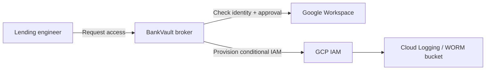

BankVault is a just-in-time access broker built for retail lending teams. It replaces standing privileged grants with time-bound, conditional IAM elevations that expire automatically and leave a complete audit trail.

## Problem

Lending operations need privileged access to production systems during incidents, vendor escalations, and batch failures. Standing admin grants are convenient but create a large blast radius. When a credential is compromised or an employee changes role, the excess permission often stays in place until the next access review.

## Approach

BankVault sits between the user and GCP. An engineer requests access through a lightweight workflow tied to Google Workspace identity. If approved, BankVault provisions a conditional IAM binding scoped to a specific project or resource, with a maximum lifetime of four hours. The grant expires automatically and every action is logged.

## Architecture decisions

- [ADR-010: Just-in-time access broker](/adrs/adr-010-jit-access-broker/)
- [ADR-009: AI vendor deployment and fair-lending compliance](/adrs/adr-009-ai-vendor-deployment/)
- [ADR-011: Alert routing with Brevo](/adrs/adr-011-alert-routing/)

## Cost target

Under $5 per month at low volume using Cloud Functions, Firestore, and native IAM conditions. A commercial PAM is avoided in the first release to keep costs and operational overhead low.

## Status

In development. The core broker, workflow UI, and IAM condition provisioning are being built and unit-tested before deployment to a live GCP project.
