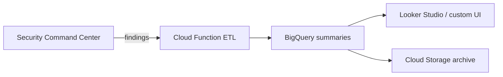

The CSPM Dashboard turns Security Command Center findings into a view that risk committees and board members can use. It combines raw finding detail with business context: cost exposure, operational impact, and named owners.

## Problem

SCC produces detailed technical findings, but the output is not shaped for governance conversations. A board member cannot easily answer three questions from the raw console: how much could this cost, which business process is threatened, and who owns the fix.

## Approach

The dashboard ingests SCC findings, enriches them with project ownership and service-dependency data, and presents two views:

- **Executive view:** risk score, open findings by severity, trend over time, and top owners.
- **Operational view:** per-finding detail with remediation steps, evidence links, and status tracking.

## Architecture decisions

- [ADR-012: CSPM data retention](/adrs/adr-012-cspm-data-retention/)
- [ADR-011: Alert routing with Brevo](/adrs/adr-011-alert-routing/)

## Cost target

Under $5 per month at low volume. BigQuery stores daily summaries rather than full finding events, and long-term archives move to Cloud Storage Nearline after one year.

## Status

In development. The data model and enrichment pipeline are being built before connecting a live Looker Studio or custom frontend.
