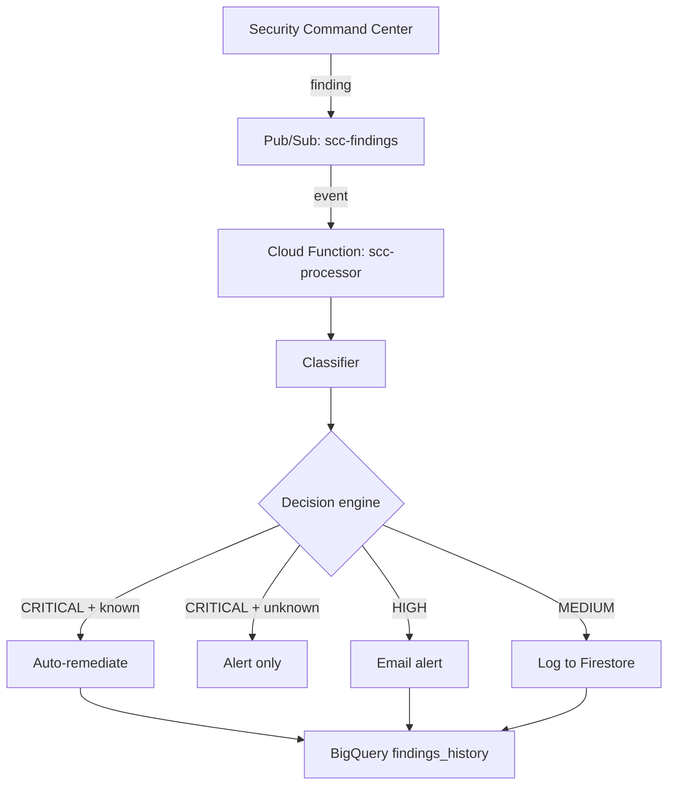

In my work with banks and other financial companies, I keep seeing the same problem: Google Cloud's Security Command Center flags misconfigurations every day, but the alerts pile up unread. Public storage buckets, firewall rules open to the internet, and over-privileged service accounts are the kind of findings that should be fixed immediately, yet they often wait for a manual review that never comes.

I built SecureVault to close that gap. It is a small, event-driven pipeline that reads SCC findings, decides how serious each one is, and acts automatically when the risk is clear.

## What it does

SecureVault consumes SCC findings from a Pub/Sub topic, classifies each one, and takes one of three actions:

- Critical findings in a known class are fixed automatically and an alert is sent.
- High-severity findings are escalated to a human by email.
- Medium-severity findings are logged for trend analysis.

The classes that get automatic remediation today are public Cloud Storage buckets and open VPC firewall rules. These are high-impact and low-risk to fix. Over-privileged service accounts are deliberately alert-only: SCC identifies that an account is over-privileged, but not which role is excessive, so a blind handler would strip every predefined role and could cause a larger outage than the finding itself. If SecureVault sees a critical finding it does not recognize, it alerts instead of acting, so automation never runs blind.

Every action is written to Firestore for fast operational lookups and to BigQuery for long-term analysis. Cloud Audit Logs capture IAM changes, so there is a built-in third layer of evidence.

## Stack and rationale

I kept the stack small. Each service solves one problem and stays inside GCP's free tier at low volume.

- Security Command Center is the native findings source. No extra license, no data egress.
- Cloud Pub/Sub decouples SCC from the processor and buffers messages if the function is redeploying or busy.
- Cloud Functions Gen 2 runs the single-purpose event handler with automatic scaling and a generous free tier, restricted to internal-only ingress and connected to a private VPC.
- Firestore holds the remediation log for fast lookups.
- BigQuery stores historical findings in a date-partitioned table, keeping trend queries cheap.
- Brevo sends email alerts on its free tier. If Brevo is unavailable, the function logs the failure and continues.
- Terraform defines every resource, so the environment is reproducible and CI can run `terraform plan` on every change.

## How I built it

I designed every part of SecureVault: service selection, threat model, response matrix, IAM model, compliance mapping, and cost ceiling. Once the design was clear, I used an AI coding assistant as an implementation engineer. It wrote the Terraform, Python, tests, and documentation, then ran security scanners and fixed the issues it found.

That split let me focus on the parts that matter: least-privilege permissions, what happens when a finding is poisoned, and how to keep monthly cost under five dollars. Every source file carries an attribution header that reads **"Architect: Lanre Oluokun | Implementation: AI-assisted."**

A recent hardening pass added production-grade controls: a VPC with Cloud NAT, customer-managed encryption keys via Cloud KMS, access logging, deletion protection, secret environment variables, and a Checkov-clean Terraform baseline (62 passed, 0 failed, 1 documented skip).

## Cost and security

The target operating cost is under five dollars per month, with a hard ceiling of twenty dollars. At roughly one hundred findings per month, the projected cost is a few cents. At one hundred times that volume, it is still under the ceiling. The hardening pass intentionally trades the strict under-$5 target for production-grade security controls.

Security was not an afterthought. The Pub/Sub topic only allows the SCC notification service account to publish. The Cloud Function runs under a dedicated service account with a custom role scoped to remediation-adjacent permissions. Only the storage and compute permissions are exercised today; IAM/resourcemanager permissions for the excluded service-account handler remain provisioned as documented technical debt. The Brevo API key lives in Secret Manager, never in code. CI runs Bandit, pip-audit, Checkov, and truffleHog on every push, and Checkov results are uploaded to the GitHub Security tab as SARIF.

> **Update (2026-07-03):** Fixed a TruffleHog configuration bug in the CI pipeline. The secret scanner was failing on every `push` to `main` because `base` and `head` both pointed to the same commit. The fix uses conditional expressions so TruffleHog scans the full history on push and the diff on pull requests.
>
> **Update (2026-07-03):** Fixed Node.js 20 deprecation warnings in CI by bumping `actions/checkout` and `actions/setup-python` to their latest patches, and resolved a Terraform Plan step showing 0s duration by removing the `pull_request`-only guard so the plan runs on every push/PR. Details: [Fixing two CI gremlins in SecureVault](/notes/ci-fix-securevault/).
>
> **Update (2026-07-03):** Gated Terraform Plan on the presence of `secrets.GCP_TERRAFORM_SA_KEY` so `fmt`/`init`/`validate` still run when the credential is absent, while `plan` and the PR comment are skipped cleanly with an explicit log message. Details: [Gating Terraform Plan on a live GCP credential](/notes/ci-terraform-secret-gate/).
>
> **Update (2026-07-03):** Consolidated CI/CD workflows: deleted the redundant `security-scan.yml` and zombie `terraform-plan.yml`, pinned all CI tool versions, and replaced the fake deploy `verify` job with a real GitHub Checks API gate. Details: [Consolidating SecureVault's CI/CD workflows](/notes/ci-workflow-consolidation/).
>
> **Update (2026-07-03):** Corrected the documentation across `README.md`, ADR-004, ADR-007, and `context/THREAT_MODEL.md` to reflect that only two finding classes (`PUBLIC_BUCKET_ACL`, `OPEN_FIREWALL`) are auto-remediated; `OVER_PRIVILEGED_SA` is alert-only by design, and the unused IAM-mutation permissions in the `securevault.remediator` role are flagged as technical debt.

## What is next

SecureVault is deliberately scoped for a first release. The next phase includes multi-source ingestion from Cloud Armor and VPC Flow Logs, SOAR connectors, analyst tiering, expanded remediation handlers, and multi-region backup.

## Architecture decision records

The decisions behind SecureVault are written down before they're defended out loud. All eight ADRs are published here:

- [ADR-001: Security Command Center over third-party CSPM](/adrs/adr-001-scc-over-cspm/)
- [ADR-002: Event-driven ingestion over polling](/adrs/adr-002-event-driven-architecture/)
- [ADR-003: Cloud Functions Gen 2 over Cloud Run over GKE](/adrs/adr-003-cloud-functions-gen2/)
- [ADR-004: Severity classification and response matrix](/adrs/adr-004-severity-response-matrix/)
- [ADR-005: BigQuery + Firestore over a single database](/adrs/adr-005-bigquery-plus-firestore/)
- [ADR-006: Brevo free tier over PagerDuty / SNS / Slack](/adrs/adr-006-brevo-free-tier-alerting/)
- [ADR-007: Threat model and trust boundaries](/adrs/adr-007-threat-model-and-trust-boundaries/)
- [ADR-008: Cost strategy for continuous operation under $20/month](/adrs/adr-008-cost-strategy-under-20-usd/)

## Explore the code

The full source, Terraform, tests, and documentation are on GitHub:

**[github.com/Bigbadlonewolf/SecureVault](https://github.com/Bigbadlonewolf/SecureVault)**
